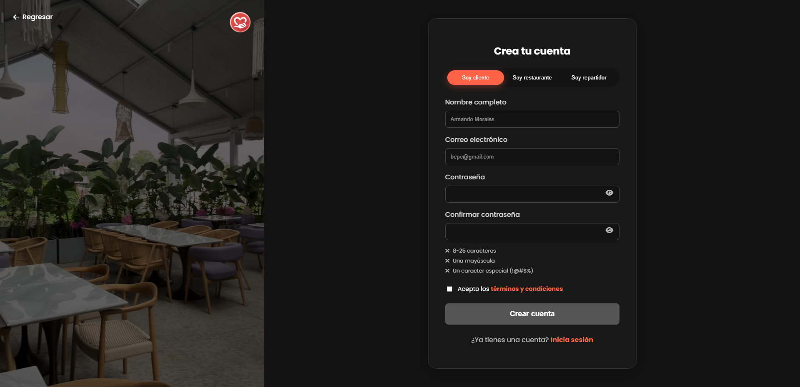
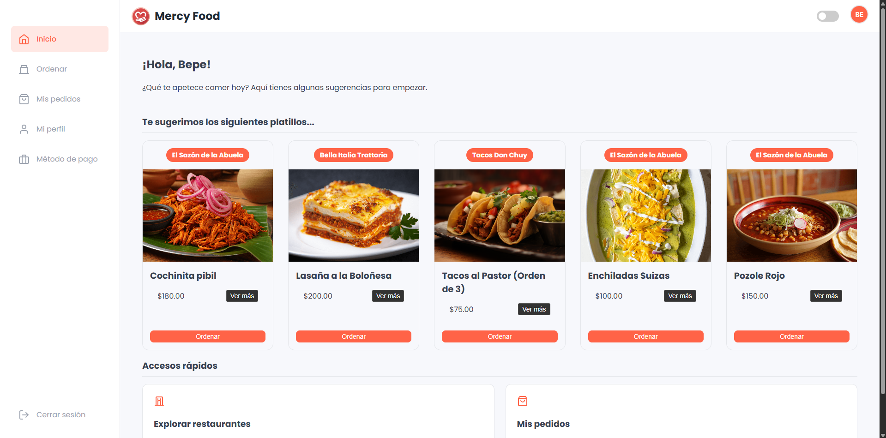
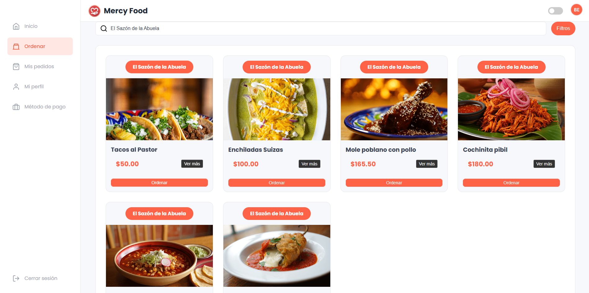
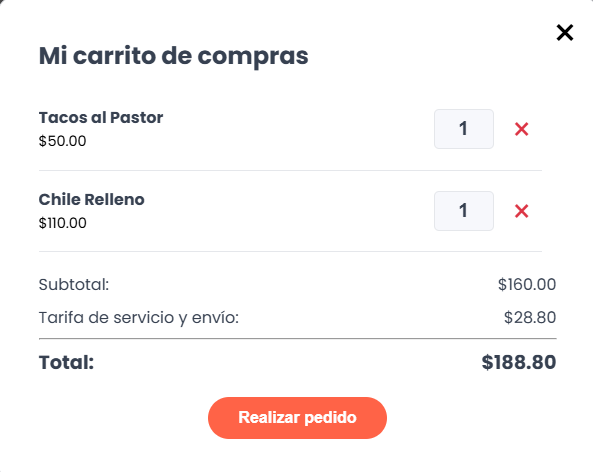
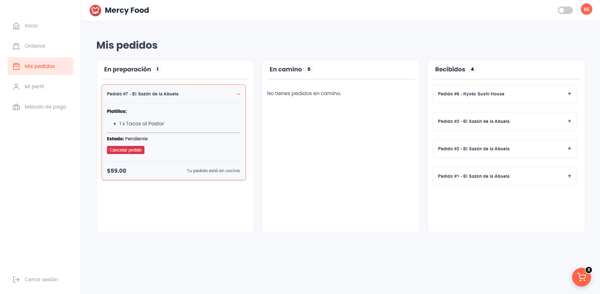
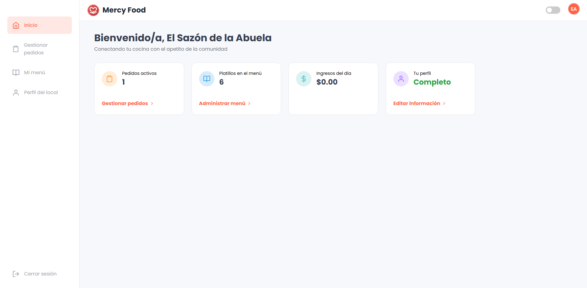
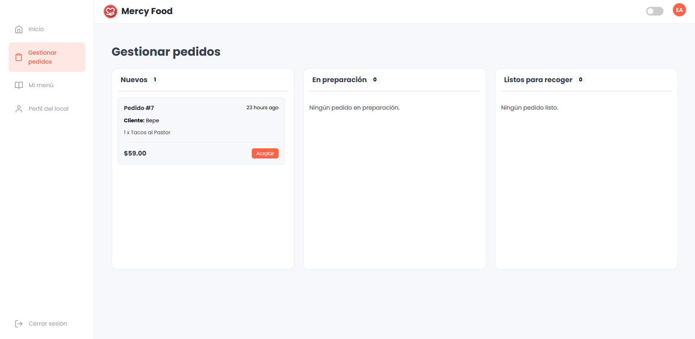
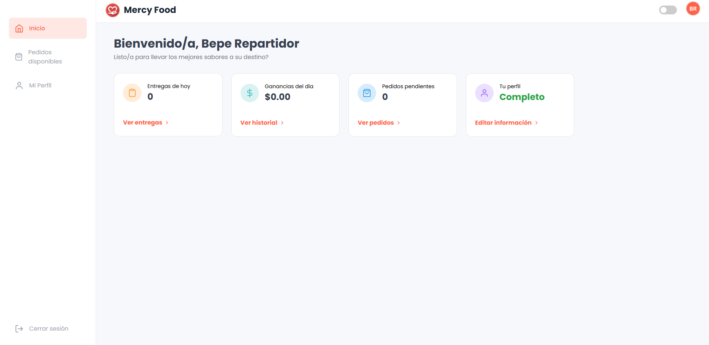
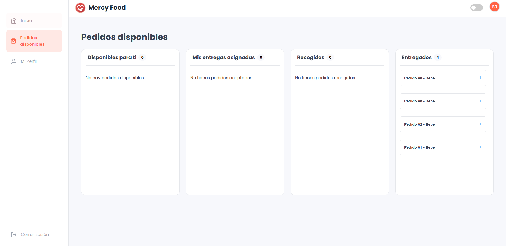

# **Manual de usuario interactivo de Mercy Food**

## **Bienvenido/a a Mercy Food**

Este manual proporciona una guía completa sobre cómo utilizar la plataforma Mercy Food. Haz clic en cada sección para expandir y ver las instrucciones detalladas para cada tipo de usuario.

---

<h3><strong>🍽️ 1. Guía para el cliente</strong></h3>

> Esta sección te guiará a través del proceso de registro, exploración de restaurantes, creación de un pedido y seguimiento del mismo hasta que llegue a tu puerta.

 

<strong>1.1. Creación de una cuenta y acceso</strong>

Para empezar a usar Mercy Food, primero necesitas una cuenta.

1.  **Registro:**
    * En la página de inicio, haz clic en el botón **"Registrarse"**.
    * Rellena el formulario con tu nombre, correo y contraseña. Asegúrate de seleccionar el rol **"Cliente"**.
    * Haz clic en **"Crear cuenta"**. Serás redirigido automáticamente a tu panel.
    
    

2.  **Inicio de sesión:**
    * Si ya tienes una cuenta, haz clic en **"Iniciar sesión"**.
    * Ingresa tu correo electrónico y contraseña para acceder a tu panel principal.

<strong>1.2. Explorando y realizando un pedido</strong>

Una vez dentro de tu cuenta, el proceso para pedir comida es muy sencillo.

1.  **Ver restaurantes disponibles:**
    * En tu panel principal (`/cliente/inicio`), verás la lista de todos los restaurantes afiliados.
    
    

2.  **Seleccionar un restaurante y ver su menú:**
    * Haz clic en el botón **"Ver menú"** del restaurante que te interese para ver todos sus platillos.
    
    

3.  **Añadir platillos al carrito y pagar:**
    * Selecciona la cantidad deseada de un platillo y haz clic en **"Agregar al carrito"**.
    * Cuando estés listo, ve a tu carrito, revisa el resumen y procede al pago.
    * Ingresa los detalles de tu tarjeta (de forma simulada) y haz clic en **"Confirmar pago"**.
    
    

<strong>1.3. Seguimiento de pedidos y gestión de perfil</strong>

1.  **Ver el estado de tus pedidos:**
    * En el menú de tu panel, ve a la sección **"Mis pedidos"**.
    * Aquí podrás ver el estado en tiempo real de tu pedido: **"Recibido"**, **"En preparación"**, **"En camino"** o **"Entregado"**.
    
    

2.  **Actualizar tu perfil:**
    * Ve a la sección **"Mi perfil"** para actualizar tu nombre, teléfono y dirección de entrega.

 

---

<h3><strong>👨‍🍳 2. Guía para el restaurante</strong></h3>

> Esta sección explica cómo los dueños de restaurantes pueden gestionar su presencia en Mercy Food, desde administrar su menú hasta procesar los pedidos que reciben.

 

<strong>2.1. Administración del menú (CRUD de Platillos)</strong>

Tu menú es tu carta de presentación. Mantenerlo actualizado es clave.

1.  **Ver tu menú:**
    * En tu panel, navega a la sección **"Menú"** para ver una tabla con todos tus platillos.
    
    

2.  **Añadir un nuevo platillo:**
    * Haz clic en **"Añadir platillo"**, rellena el formulario y guarda. El nuevo platillo aparecerá al instante.

3.  **Editar un platillo existente:**
    * Busca el platillo en la lista y haz clic en **"Editar"**. Modifica la información y guarda los cambios.

4.  **Eliminar un platillo:**
    * Si un platillo ya no está disponible, haz clic en **"Eliminar"**. Se te pedirá confirmación.

<strong>2.2. Gestión de pedidos entrantes</strong>

Gestiona los pedidos de tus clientes de forma eficiente.

1.  **Ver pedidos pendientes:**
    * Navega a la sección **"Pedidos"** en tu panel para ver la lista de órdenes por procesar.
    
    

2.  **Actualizar el estado de un pedido:**
    * Usa los controles junto a cada pedido para cambiar su estado de **"Recibido"** a **"En preparación"**.
    * Esto notificará al cliente sobre el progreso de su comida.

<strong>2.3. Actualizar el perfil del restaurante</strong>

* En la sección **"Perfil"**, puedes actualizar la información pública de tu restaurante, como la descripción, el logo y los horarios de atención para que los clientes siempre tengan la información correcta.

 

---

<h3><strong>🛵 3. Guía para el repartidor</strong></h3>

> Esta guía está dirigida a los repartidores, explicando cómo ver y gestionar las entregas de pedidos.

 

<strong>3.1. Gestión de entregas</strong>

1.  **Ver pedidos disponibles:**
    * En tu panel principal, verás una lista de pedidos listos para ser recogidos, mostrando la dirección del restaurante y del cliente.
    
    

2.  **Aceptar un pedido:**
    * Cuando veas un pedido conveniente, haz clic en **"Aceptar pedido"**. Esto te asignará la entrega.

3.  **Actualizar el estado de la entrega:**
    * A medida que avanzas, actualiza el estado del pedido:
        * **"En camino al cliente"**: Cuando ya tengas el pedido.
        * **"Entregado"**: Cuando hayas completado la entrega exitosamente.
    
    

<strong>3.2. Gestión de tu perfil de repartidor</strong>

* En la sección **"Mi perfil"**, puedes actualizar tu información personal como tu nombre y teléfono de contacto. Es importante mantenerla actualizada para cualquier comunicación necesaria.

 

